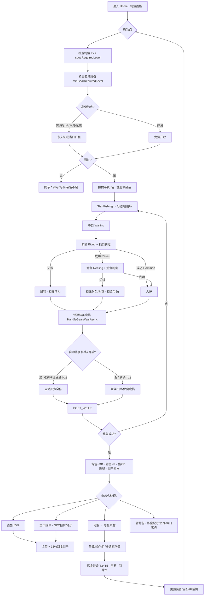
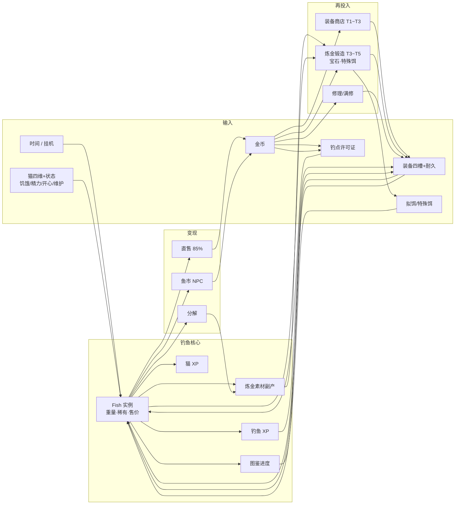

# 钓鱼玩法流程与资源闭环（代码深潜）

> 本文档从**实现代码**提炼玩家流程与技术时序，侧重「怎么串起来」；公式与常量细节见 [`game-design.md`](game-design.md)。  
> 精读来源：`FishingManager`、`FishingService`、`Home.razor` 及装备/经济/市场/炼金相关模块。

---

## 1. 钓鱼玩法全流程（玩家视角）

### 1.1 总览流程图



### 1.2 分步说明（numbered）

1. **选钓点**  
   UI 按 **区域阶段**（`FishingSpotCatalog.RegionGroups()`）展示 **13 个钓点**（`FishingSpotCatalog.BuildAll()`）。远礁/墓场/回廊/星潮/虚空 `FishingTime=1`（等口更短），其余多为 `2`。

2. **门槛检查**（`StartFishingAsync`）  
   - 玩家 `FishingLevel ≥ spot.RequiredLevel`  
   - `FishingLoadout.MeetsGearLevel`（四槽 `RequiredLevel` 取最大）  
   - 高级钓点：`SpotLicenseCatalog.RequiresLicense` → 永久证或当日 UTC 日租（虚空钓域另需全神话 14/16）  
   - `FishingSessionRegistry`：同一账号仅允许一个挂机会话  
   - 金币 ≥ `CastFeeForSpot(spot)`（静溪 3g → 虚空 58g），**开始挂机时扣一次**，非每轮

3. **构建 Loadout**（`EquipmentService.BuildLoadoutAsync`）  
   竿/轮/线/饵 + 镶嵌宝石 `GemBonuses` + 里程碑 `MilestoneRarityBonus` + 装备特殊饵 `ActiveTargetLureRecipeId` + 钓点竿阶有效率 `SpotGearEffectiveness`。

4. **抛竿挂机**  
   每轮异步循环：`RollCatch` → 等口 → 抓口 →（非 Common）遛鱼 → 成功/失败分支。

5. **入护**（`HandleFishCaughtAsync`）  
   内存背包 + `FishingService.SaveCaughtFishAsync` + `FishRecordService` 图鉴记录 + 钓鱼/猫 XP + 可选每日求购 + ~22% 钓获副产。

6. **处置鱼获**  
   - **直售**：`FishingService.SellFishAsync` → `SellPrice × 0.85` + `GrantRecycleBonusAsync`  
   - **鱼市**：扣上架费 `max(5g, 2%售价)`，等 NPC 报价（150 tick≈5min），可还价 +10%  
   - **分解**：`GearMaterialService.DisassembleFishAsync`，鱼从背包移除换素材  
   - **炼金消耗**：配方扣背包鱼 + 素材 + 金币加工费

7. **反哺与自动维护**  
   - 金币买商店 T1~T3、修耐久、许可证；素材+鱼炼 T3~T5；图鉴% 解锁商店/锻造；钓鱼 Lv 解锁钓点与装备。
   - **智能自动修复系统**：玩家可在商店购买该工具后，在挂机/钓鱼期间当装备耐久低于设定阈值（5%~50%）时，自动消耗金币进行全修，避免高频手动操作打断钓鱼循环。

---

## 2. 单条钓鱼周期（技术时序）

### 2.1 与 2s 全局 Tick 的关系

| 时钟 | 职责 |
|------|------|
| **2s `gameTimer`**（`Home.razor` `OnTimerElapsed`） | 猫背景衰减、打工金币、喂食/饮水器、维护费（720 tick/日）、NPC 市场报价、存档；**不驱动钓鱼状态机** |
| **FishingManager 异步循环** | 每轮钓鱼独立计时；阶段内 `Task.Delay(250ms)` 刷新 `PhaseRemainingSeconds` |

钓鱼一轮的墙钟时间 ≈ `waitSeconds + biteWindow + [reelSeconds]`，通常 **数秒～数十秒**，与 2s tick 无固定整数倍关系。

### 2.2 单轮时序（`RunLoopAsync`）

```
┌─ 每轮开始 ─────────────────────────────────────────────┐
│ 1. 读取 CatFishingBuff（状态）+ CatFishingStats（六维）   │
│ 2. spot.RollCatch(ctx) → (fish, template)              │
│    rarityBonus = 饵品质 + 猫LUK + 里程碑 + 宝石Luck      │
│    + 特殊饵匹配时进入神话池                               │
└────────────────────────────────────────────────────────┘
         │
         ▼
┌─ Waiting 等口 ─────────────────────────────────────────┐
│ baseWait = U(5, 25)                                      │
│ f_wait = (1 - Attraction - FishingLv×0.003 - Cast×0.02)  │
│        × catStats.WaitMultiplier                         │
│ wait = max(2, baseWait × max(0.1,f_wait))                │
│        × spot.FishingTime/3                              │
│        × catBuff.WaitTimeMultiplier × WaitTimePenalty    │
│ UI: PhaseRemaining 每 250ms 更新                          │
└────────────────────────────────────────────────────────┘
         │
         ▼
┌─ Biting 咬钩 ──────────────────────────────────────────┐
│ 窗口 = template.BiteWindowSeconds × BiteWindowMultiplier │
│       （精明度越高窗口越短：3.0 - 1.5×Wariness）          │
│ depthBonus = 饵/线水层匹配（各+5%，上限10%）              │
│ P_hook = clamp(0.70 + 装备敏锐/抛投/线敏/深度/Lv/宝石     │
│              + catHook - Wariness×0.40×(1-Stealth)       │
│              - SuccessPenalty, 5%, 98%)                  │
│ 失败 → Log脱钩 → OnGearWear(false) → CompleteCycle      │
└────────────────────────────────────────────────────────┘
         │ 成功
         ▼
    fish.Rarity == Common ?
         │是                    │否
         ▼                      ▼
    跳过 Reeling          ┌─ Reeling 遛鱼 ─────────────┐
                          │ reel = max(1.5, U(3,5)×5/GearRatio) │
                          │ weightPenalty 超重/占比 × STR减免      │
                          │ P_land = clamp(0.60 + 卸力/顺滑/Lv/宝石  │
                          │   + catLand - weightPenalty            │
                          │   - Power×0.20 - penalty, 5%, 95%)     │
                          │ 失败 → 切线分支（见下）                 │
                          └──────────────────────────────────────┘
         │
         ▼
┌─ 成功入护 ─────────────────────────────────────────────┐
│ OnGearWear(false)                                        │
│ 若特殊饵命中神话模板 → OnTargetLureConsumed              │
│ OnFishCaught(fish) → Home 落库/XP/图鉴/副产              │
│ CompleteCycle → OnCycleComplete → 猫 FishingCycle 消耗   │
└────────────────────────────────────────────────────────┘
         │
         └── continue → 下一轮（直到 StopFishing / 断线）
```

### 2.3 失败/切线分支

| 分支 | 状态机行为 | 持久化回调（Home） |
|------|-----------|-------------------|
| **脱钩**（抓口失败） | `OnGearWear(false)`，无切线消耗 | `WearEquippedGearAsync`：竿/轮/线耐久 -1~3（+钓点额外磨损） |
| **切线/爆轮**（遛鱼失败） | `ConsumeLineDurability`（内存线耐久 -8×(1-耐磨)）；`ConsumeLureDurability`（拟饵 -1 次）；`OnGearWear(true)` | `HandleGearWearAsync(true)` 额外 +5 耐久损耗；`HandleLureConsumedAsync` 同步饵/线 DB，扣 `LineRepairFee` 5g |
| **收竿** | `StopFishing` 取消 CTS | 释放 `FishingSessionRegistry` |

**注意**：脱钩与成功都会 `OnCycleComplete`，均扣 `FishingCycle` 猫精力（-10⚡ 等）；抛竿费仅在**开始**扣 3g。

### 2.4 智能自动修复机制

为了解决手动修复装备过于频繁的问题，引入了**智能自动修复系统**。

* **解锁条件**：可在渔具商店中花费 `3000g` 一次性购买“自动修复工具”解锁（保存在 [Player.cs](file:///c:/Users/wen.jijiang/Desktop/blazor_test/CyberPetApp/Models/Player.cs) 的 `AutoRepairUnlocked` 中）。
* **参数配置**：
  - **开关**：解锁后可随时在 UI 中开启或关闭自动修复。
  - **阈值**：设置触发自动修复的耐久度百分比（范围 5%~50%，步长为 5%）。
* **工作流与触发时机**：
  - 触发点嵌入在**磨损结算**阶段（`HandleGearWearAsync`），该操作在数据库写锁（`WithDbLock`）内执行。
  - 每次抛竿挂机发生耐久度变化时（无论是成功钓获、脱钩还是切线），系统会检查当前已装备的 **鱼竿**、**卷线器**、**鱼线** 耐久度百分比。
  - 如果任意一件装备的耐久度 $\le$ 设定的阈值，且玩家拥有的金币足够支付该装备的**全额修复费用**（遵循 [EconomySinks.cs](file:///c:/Users/wen.jijiang/Desktop/blazor_test/CyberPetApp/Models/EconomySinks.cs) 的标准定价），则会自动扣款执行满额修复。
  - **控制台输出**：
    - 修复成功：在钓鱼终端日志中打印 `[时间] 自动修复: [物品名]已完全修复，消耗 [X] 金币`（绿色显示）。
    - 金币不足导致修复失败：打印 `[时间] 自动修复失败: 金币不足，需要 [X] 金币`（红色显示），挂机不会中断，但装备耐久会继续消耗。

---

## 3. 资源闭环图

### 3.1 主闭环（Mermaid）



### 3.2 并列 Sink（金币/耐久流出）

```
钓鱼会话与维护
  ├─ CastFeeForSpot 3~58g （开始挂机，一次，随钓点阶）
  ├─ LineRepairFee 5g    （切线，OnLureConsumed）
  ├─ 自动修复工具 3000g   （渔具商店一次性解锁购买）
  ├─ 自动全额修复扣费      （装备耐久度降至阈值时自动全修，直接扣除等量金币）
  ├─ 装备耐久 1~3/轮      （脱钩/成功/切线；切线+5；远礁+3 …）
  ├─ 拟饵次数             （切线-1；耗尽扣库存）
  ├─ 鱼线内存耐久         （切线 -8×(1-耐磨)，<30 顺滑减半）
  └─ 猫精力 -10/轮        （FishingCycle）

高级钓点
  ├─ 日租 300~800g/UTC日
  └─ 永久证 8000~25000g

鱼市
  └─ 上架费 max(5g, 售价×2%)（不退）

炼金/加工
  ├─ 锻造 T3~T10：1200 / 6500 / 20k / 42k / 68k / 98k / 135k / 185k g
  ├─ 宝石 500g · 特殊饵 800g+ · 镶嵌 200g
  └─ 烹饪按稀有度 5~100g

房屋
  └─ 维护费 (房间×15 + 家具×8 + 升级×3) / 720tick；拖欠×2且钓鱼-8%

并行打工（非钓鱼 sink，但竞争时间/精力）
  └─ 工地 0.7g/tick（2s）≈ 21g/min；鱼市搬运工缩短 NPC 报价间隔
```

### 3.3 ASCII 闭环简图

```
     [时间+猫状态+装备+饵+许可]
              │
              ▼
         ┌─────────┐
         │  钓鱼   │──→ 鱼 / 钓鱼XP / 猫XP / 图鉴 / 素材副产
         └────┬────┘
              │
    ┌─────────┼─────────┐
    ▼         ▼         ▼
 直售85%   鱼市NPC    分解
    │         │         │
    └────┬────┴────┬────┘
         ▼         ▼
       [金币]   [炼金素材]
         │         │
         ├→ 商店装备 / 修耐久 / 许可证
         └→ 炼金 → T3~T10装备 · 宝石 · 神话饵
                      │
                      └──────→ 更高钓点 & 神话鱼 ──┐
                                                  │
              sink: 抛竿·切线·耐久·上架·加工·维护 ◄──┘
```

---

## 4. 各系统衔接表

| 系统 | 从钓鱼获得 | 反哺钓鱼 |
|------|-----------|----------|
| **钓鱼状态机** ([FishingManager.cs](file:///c:/Users/wen.jijiang/Desktop/blazor_test/CyberPetApp/Services/FishingManager.cs)) | — | 核心产出节奏；装备/猫 buff 决定成功率 |
| **持久化** ([FishingService.cs](file:///c:/Users/wen.jijiang/Desktop/blazor_test/CyberPetApp/Services/FishingService.cs)) | 鱼入库 | — |
| **玩家钓鱼等级** ([Player.cs](file:///c:/Users/wen.jijiang/Desktop/blazor_test/CyberPetApp/Models/Player.cs)) | Common9/Rare26/Epic65/Legendary160；Lv40+×0.85；超规格×1.6 | 解锁钓点、装备 `RequiredLevel`、公式内 Lv 项 |
| **猫等级/六维** ([CatFishingStats.cs](file:///c:/Users/wen.jijiang/Desktop/blazor_test/CyberPetApp/Models/CatFishingStats.cs)) | `XpFromFish` 4/10/22/48；神话×1.25；Lv40+ XP 指数放缓 | 抓口/起鱼/等口/咬钩窗/精力消耗减免 |
| **猫状态** ([CatBuffHelper.cs](file:///c:/Users/wen.jijiang/Desktop/blazor_test/CyberPetApp/Models/CatBuffHelper.cs)) | — | 开心+稀有权重；低饥疲-成功率；维护拖欠-8% |
| **装备与自动修复** ([EquipmentService.cs](file:///c:/Users/wen.jijiang/Desktop/blazor_test/CyberPetApp/Services/EquipmentService.cs) + [FishingLoadout](file:///c:/Users/wen.jijiang/Desktop/blazor_test/CyberPetApp/Models/FishingGear.cs)) | 磨损触发耐久流失；低于阈值时触发自动扣款全修 | 敏锐/卸力/饵品质/承重/水层匹配；开启自动全修降低高频手动操作的频率 |
| **玩家配置** ([Player.cs](file:///c:/Users/wen.jijiang/Desktop/blazor_test/CyberPetApp/Models/Player.cs)) | — | 提供 `AutoRepairUnlocked`、`AutoRepairEnabled`、`AutoRepairThreshold` 控制状态 |
| **钓点** ([FishingSpotCatalog.cs](file:///c:/Users/wen.jijiang/Desktop/blazor_test/CyberPetApp/Models/FishingSpotCatalog.cs)) | `PriceMultiplier` 抬高售价 | `RequiredLevel`、稀有度表、神话鱼表 |
| **许可证** ([SpotLicenseService.cs](file:///c:/Users/wen.jijiang/Desktop/blazor_test/CyberPetApp/Services/SpotLicenseService.cs)) | — | Lv3+ 钓点准入；T4 锻造需雾海证 |
| **图鉴** ([FishDexCatalog.cs](file:///c:/Users/wen.jijiang/Desktop/blazor_test/CyberPetApp/Models/FishDexCatalog.cs) + [FishRecordService.cs](file:///c:/Users/wen.jijiang/Desktop/blazor_test/CyberPetApp/Services/FishRecordService.cs)) | 记录钓获 | 商店/锻造门槛（静溪50%、全图鉴80%等） |
| **素材** ([GearMaterialService.cs](file:///c:/Users/wen.jijiang/Desktop/blazor_test/CyberPetApp/Services/GearMaterialService.cs)) | 钓获~22%副产；直售35%回收；分解主产出 | 炼金配方输入 |
| **炼金** ([AlchemyService.cs](file:///c:/Users/wen.jijiang/Desktop/blazor_test/CyberPetApp/Services/AlchemyService.cs)) | — | T3~T10装备、宝石、特殊神话饵 |
| **鱼市** ([MarketService.cs](file:///c:/Users/wen.jijiang/Desktop/blazor_test/CyberPetApp/Services/MarketService.cs)) | 高于直售 of NPC 价；摊位券扩上限 | 金币回流；鱼市搬运工加速报价 |
| **里程碑** ([AchievementService.cs](file:///c:/Users/wen.jijiang/Desktop/blazor_test/CyberPetApp/Services/AchievementService.cs)) | 钓获/卖鱼进度 | `MilestoneRarityBonus`、`CounterBonus` 还价 |
| **每日求购** ([DailyBountyService.cs](file:///c:/Users/wen.jijiang/Desktop/blazor_test/CyberPetApp/Services/DailyBountyService.cs)) | 指定鱼额外金币 | 引导留鱼而非直售 |
| **烹饪** ([CookingService.cs](file:///c:/Users/wen.jijiang/Desktop/blazor_test/CyberPetApp/Services/CookingService.cs)) | 鱼消耗 | 猫食 buff → [CatBuffService.cs](file:///c:/Users/wen.jijiang/Desktop/blazor_test/CyberPetApp/Services/CatBuffService.cs) 合并进钓鱼 |
| **派遣/打工** | 齿轮组、打工金币 | 金币买装备/许可；与钓鱼争猫精力 |
| **房屋维护** ([MaintenanceService.cs](file:///c:/Users/wen.jijiang/Desktop/blazor_test/CyberPetApp/Services/MaintenanceService.cs)) | — | 拖欠 debuff 钓鱼；家具 buff 降开心阈值等 |
| **CHM 魅力** | 升级时分配 | **当前未接入钓鱼/市场公式**（见 §7） |

---

## 5. 数值关键节点

### 5.1 钓点门槛一览

| 钓点 | 钓鱼 Lv | 许可证 | 售价系数 | FishingTime | 默认稀有度表 (C/R/E/L) | 最低有效竿阶 |
|------|---------|--------|----------|-------------|------------------------|--------------|
| 静溪 | 1 | 无 | ×1.0 | 2 | 70/20/8/2 | T1 |
| 雾海深渊 | 3 | 有 | ×1.25 | 2 | 55/25/14/6 | T2 |
| 夜光引渠 | 5 | 有 | ×1.5 | 2 | 50/28/16/6 | T3 |
| 极光冰湾 | 8 | 有 | ×1.8 | 2 | 42/30/20/8 | T3 |
| 远礁外海 | 12 | 有 | ×2.2 | **1** | 35/32/22/11 | T4 |

许可证费用（`EconomySinks`）：雾海永久 8000/日租 300 → 远礁永久 25000/日租 800。

竿阶不足有效率：`max(0.35, 1 - gap×0.18)`，影响 `EffectiveSensitivity` / `EffectiveDragPower`。

### 5.2 装备阶位 T1~T10（500h 毕业）

累计目标：T3 ~40h · T6 ~160h · T8 ~310h · T10 ~500h。里程碑 Tab 显示「终极毕业进度 %」。

### 5.3 装备阶位 T1~T5（中期参考）

| 阶 | 标签 | 获取主路径 | 代表解锁条件 |
|----|------|-----------|--------------|
| T1 | 入门 | 默认+商店 | — |
| T2 | 进阶 | 商店 | 钓鱼 Lv5、猫 Lv3 |
| T3 | 精工 | 商店+炼金 | 钓鱼 Lv12、静溪图鉴 50% |
| T4 | 深海 | 炼金为主 | 钓鱼 Lv20、雾海许可证 |
| T5 | 神话 | 炼金 | 钓鱼 Lv30、全图鉴 80%、传说鱼素材 |

策划目标时长（`GearProgressionCatalog` 注释）：T3 全套 8~15h；T5 全套 40~60h；T5 等效金币 50万~80万。

### 5.3 神话鱼条件

1. 炼金合成对应 **特殊路亚饵**（`AlchemyRecipes.TargetLures`，800g+ 及鱼素材/派遣物品）。  
2. 装备该饵（`PlayerTargetLure`，有限次数）。  
3. 在**匹配钓点**挂机（`TargetLureSpot == spot.Name`）。  
4. 鱼表条目带 `TargetLureRecipeId`，平时不进池；激活后：  
   - **22%** 直接命中该模板（`TargetFishDirectRollChance`）；  
   - 否则进加权池，匹配鱼 `SpawnWeight×20`。  
5. 成功钓获匹配神话鱼 → `OnTargetLureConsumed` 扣 1 次特殊饵。  
6. 神话鱼售价 ×1.4；分解得 **神话鳞粉×2** 等。

全服共 **7** 条神话（静溪×2、雾海、引渠、冰湾、远礁×2）。

### 5.4 经济比例（代码可见）

| 来源 | 数值 | 备注 |
|------|------|------|
| 工地打工 | **0.7g / 2s tick** ≈ 21g/min ≈ 1260g/h | `WorkingPlace.GoldPerTick` |
| 钓鱼卖鱼 | 高度变异 | 取决于钓点 `PriceMultiplier`、稀有度、成功率、周期长度 |
| 开始抛竿 | 3g / 会话 | 非每轮 |
| 猫钓鱼精力 | -10⚡ / 轮 | 设计目标 3~5 轮/min → 30~50⚡/min |
| 直售 vs 市场底价 | 85% vs 90% | NPC 成交价可高于底价（人格偏好） |

钓鱼后期分钟收益可远超打工，但受精力、耐久、许可、切线修理约束；打工提供稳定金币与摊位券（150 tick/张）。

### 5.5 关键公式索引（详见 game-design.md）

- 等口：`waitSeconds = max(2, baseWait × f_wait × FishingTime/3 × 猫AGI × 状态惩罚)`  
- 抓口：`P_hook = clamp(0.70 + 装备项 + catHook - Wariness×0.40×(1-Stealth) - penalty, 5%, 98%)`  
- 起鱼：`P_land = clamp(0.60 + 装备项 - weightPenalty - Power×0.20 - penalty, 5%, 95%)`  
- 售价：`weight×10×稀有倍率×(1+size²)×PriceMultiplier`  
- 玩家钓鱼升级：`XpToNext = 100 × level^1.5`  
- 猫升级：`XpToNext = 100 × level^1.4`

---

## 6. 当前设计优点

1. **三阶段状态机清晰可感知**：等口→咬钩→遛鱼分阶段 UI（`PhaseRemainingSeconds`），Rare+ 才有遛鱼张力，Common 快速过竿，适合挂机节奏。  
2. **多层成长主轴分工明确**：装备碾压鱼的 `Wariness`/`Power`；猫六维只做 5~15% 量级微调（`CatFishingStatsHelper` 注释目标），避免属性膨胀抢装备戏份。  
3. **钓点=内容包+经济杠杆**：同结构下用 `FishRarityTable`、`PriceMultiplier`、`FishingTime`、竿阶门槛分层，远礁缩短等口但抬高稀有权重与售价系数。  
4. **鱼获多出口形成抉择**：直售快、鱼市慢但溢价、分解喂炼金、留鱼做配方——闭环不是单按钮卖鱼。  
5. **Sink 与 2s tick 对齐**：维护费 720 tick、市场 NPC 150 tick、打工与钓鱼并行消耗猫属性，长期挂机需喂食器/饮水器/修理，抑制纯挂机通胀。

---

## 7. 问题与风险（基于代码核实）

1. **CHM 魅力未接入玩法**  
   `CatFishingStats` 读取 `Chm` 但不参与任何公式；`MarketService` 还价/出价用 `cat.Happiness`，非 CHM。UI 提示「市场/NPC 互动加成」与实现不一致。

2. **抛竿费一次性，长会话边际成本趋零**  
   `CastFee` 仅在 `StartFishingAsync` 扣 3g；挂机数小时不再付费，与注释中「抛竿费 sink」的直觉（按轮/按时）不符，可能削弱金币消耗。

3. **脱钩也磨损装备，但无修理费**  
   每轮 `OnGearWear`（含脱钩）扣 1~3 耐久；仅切线路径扣 `LineRepairFee`。低等级高频脱钩仍加速装备贬值，玩家体感可能「空竿也亏」。

4. **齿轮组等素材依赖派遣/打工，炼金链与纯钓鱼割裂**  
   T4/T5 轮系配方要 `齿轮组`（`SourceHint`：派遣/打工），纯钓鱼玩家必须切玩法，否则锻造断点。

5. **离线不模拟钓鱼**  
   `OfflineCompensationService` 补偿打工/猫衰减等，不含 `FishingManager`；离线与在线钓鱼收益差距大，可能被误读为「挂机游戏离线也钓」。

---

## 8. 改进建议

### P0（优先落地）

| # | 问题 | 建议 | 预期效果 |
|---|------|------|----------|
| 1 | CHM 无实际作用 | 将 `MarketService.ComputeCounterSuccessRate` / `BuyerPreference(MoodNpc)` 增加 `CHM` 项（如 +CHM/1000×15%）；或钓鱼稀有度 +CHM×0.01% | 六维养成有明确终点；UI 与逻辑一致 |
| 2 | 抛竿费只收一次 | 改为每 N 轮收 micro-fee（如每 10 轮 2g）或按游戏日收「钓点管理费」；保持开始钓鱼低门槛 | 长线挂机金币 sink 可持续 |
| 3 | 齿轮组来源单一 | 雾海 Rare+ 分解小概率掉齿轮组，或鱼市 NPC「工匠猫」用金币兑换 | 纯钓鱼玩家可推进 T4 轮锻造，减少 loop 断裂感 |

### P1（体验与平衡）

| # | 问题 | 建议 | 预期效果 |
|---|------|------|----------|
| 4 | 脱钩磨损无反馈 | 脱钩时 UI 轻提示耐久 -X；或脱钩不扣轮/竿只扣线 0~1 | 降低「空竿挫败」；或让损耗更可理解 |
| 5 | 静溪后期收益过低 | 满图鉴后给静溪「典藏加成」或引导日租远礁；远礁 `FishingTime=1` 已强，可微调低阶钓点 `PriceMultiplier` | 减少毕业後回静溪无意义 |
| 6 | 神话饵 22% 直中偏慷慨 | 改为 15% 或随钓鱼 Lv 递减；成功钓神话后冷却 1 游戏日 | 拉长神话追求线，避免过早毕业 |
| 7 | 鱼市与直售差距不透明 | 面板显示「直售 X / 市场底价 Y / 预估 NPC 区间」 | 减少盲目直售，提高市场参与 |

### P2（中长期）

| # | 问题 | 建议 | 预期效果 |
|---|------|------|----------|
| 8 | 离线零钓鱼 | 可选「离线委托钓鱼」：按最后钓点+装备快照模拟 M 轮（上限 cap），消耗等量精力/耐久 | 回归玩家有收益；需严格 cap 防滥用 |
| 9 | 图鉴仅门槛无战斗收益 | 每 10% 图鉴给 +0.5% 稀有或解锁钓点「专属饵」皮肤 buff | 图鉴从中期门槛变为持续追求 |
| 10 | 双耐久源（内存线 vs DB） | 切线统一只走 `EquipmentService` 扣线耐久，去掉 `Loadout.LineDurability` 内存分叉 | 减少 desync 与修线后数值不一致 bug 风险 |
| 11 | 猫咖/鱼市工种与钓鱼协同弱 | 鱼市搬运工除缩 tick 外，+5% 收藏家出价概率；猫咖 +CHM 成长 | 工种选择成为构建路线而非纯打工 |
| 12 | T5 目标 40~60h 缺遥测 | 埋点：会话轮数、平均周期、金币/h、神话钓获间隔 | 用数据校准 `GearProgressionCatalog` 注释曲线 |

---

## 9. 500h 钓点 / 鱼种规模（T1~T10 对齐）

| 阶段 | 钓点 | 解锁 | 最低竿阶 | 鱼种≈ | 神话 |
|------|------|------|---------|-------|------|
| 前期 | 静溪、浅塘 | Lv1 | T1 | 15+12 | 2 |
| T2~T3 | 雾海深渊、芦苇湾 | Lv8/Lv12 · 许可 | T2/T3 | 15+13 | 1+1 |
| T4~T5 | 夜光引渠、暗涌裂谷 | 许可+Lv18 | T4/T5 | 13+13 | 1+1 |
| T6~T7 | 极光冰湾、沉船墓场、珊瑚暗流 | 许可+Lv32 | T6/T7 | 14+13+13 | 1+1+1 |
| T8~T9 | 远礁外海、深渊回廊、星潮海沟 | 许可+Lv45 | T8/T9 | 14+12+12 | 2+1+1 |
| T10 | 虚空钓域 | 全神话+Lv60 · 许可 | T10 | 14 | 2 |

- **钓点总数**：13  
- **鱼种总数（图鉴去重）**：≈173（含 3 种跨钓点迁徙鱼）  
- **神话鱼**：16（指定饵 + 竿阶门槛）  
- **图鉴毕业**：T8 装备 ≈75%（~130 种）· T10 ≈95%（~164 种）  
- **数据表**：`FishingSpotCatalog.Generated.cs`（`tools/gen_fishing_spots.py` 生成）  
- **迁移**：`ExpandFishAndFishingSpots`（静态表无 schema 变更，标记版本）

---

## 附录：代码入口速查

| 职责 | 文件 |
|------|------|
| 状态机 | [FishingManager.cs](file:///c:/Users/wen.jijiang/Desktop/blazor_test/CyberPetApp/Services/FishingManager.cs) |
| 鱼持久化/直售 | [FishingService.cs](file:///c:/Users/wen.jijiang/Desktop/blazor_test/CyberPetApp/Services/FishingService.cs) |
| UI 流程与回调 | [Home.razor](file:///c:/Users/wen.jijiang/Desktop/blazor_test/CyberPetApp/Components/Pages/Home.razor) |
| 钓点/鱼表 | [FishingSpot.cs](file:///c:/Users/wen.jijiang/Desktop/blazor_test/CyberPetApp/Models/FishingSpot.cs), [FishingSpotCatalog.cs](file:///c:/Users/wen.jijiang/Desktop/blazor_test/CyberPetApp/Models/FishingSpotCatalog.cs), [FishingSpotCatalog.Generated.cs](file:///c:/Users/wen.jijiang/Desktop/blazor_test/CyberPetApp/Models/FishingSpotCatalog.Generated.cs) |
| 装备快照 | [FishingGear.cs](file:///c:/Users/wen.jijiang/Desktop/blazor_test/CyberPetApp/Models/FishingGear.cs) → `FishingLoadout` |
| 锻造/炼金 | [GearProgressionCatalog.cs](file:///c:/Users/wen.jijiang/Desktop/blazor_test/CyberPetApp/Models/GearProgressionCatalog.cs), [AlchemyService.cs](file:///c:/Users/wen.jijiang/Desktop/blazor_test/CyberPetApp/Services/AlchemyService.cs) |
| 素材 | [GearMaterialService.cs](file:///c:/Users/wen.jijiang/Desktop/blazor_test/CyberPetApp/Services/GearMaterialService.cs) |
| 鱼市 | [MarketService.cs](file:///c:/Users/wen.jijiang/Desktop/blazor_test/CyberPetApp/Services/MarketService.cs) |
| 猫消耗 | [CatActivityCost.cs](file:///c:/Users/wen.jijiang/Desktop/blazor_test/CyberPetApp/Models/CatActivityCost.cs) |
| 猫战斗属性 | [CatFishingStats.cs](file:///c:/Users/wen.jijiang/Desktop/blazor_test/CyberPetApp/Models/CatFishingStats.cs), [CatBuffHelper.cs](file:///c:/Users/wen.jijiang/Desktop/blazor_test/CyberPetApp/Models/CatBuffHelper.cs) |
| 许可/维护/sink | [SpotLicenseService.cs](file:///c:/Users/wen.jijiang/Desktop/blazor_test/CyberPetApp/Services/SpotLicenseService.cs), [MaintenanceService.cs](file:///c:/Users/wen.jijiang/Desktop/blazor_test/CyberPetApp/Services/MaintenanceService.cs), [EconomySinks.cs](file:///c:/Users/wen.jijiang/Desktop/blazor_test/CyberPetApp/Models/EconomySinks.cs) |
| 自动修复配置与持久化 | [Player.cs](file:///c:/Users/wen.jijiang/Desktop/blazor_test/CyberPetApp/Models/Player.cs), [AppDbContext.cs](file:///c:/Users/wen.jijiang/Desktop/blazor_test/CyberPetApp/Data/AppDbContext.cs), [PlayerService.cs](file:///c:/Users/wen.jijiang/Desktop/blazor_test/CyberPetApp/Services/PlayerService.cs) |
| 自动修复逻辑触发 | [Home.Fishing.cs](file:///c:/Users/wen.jijiang/Desktop/blazor_test/CyberPetApp/Components/Pages/Home.Fishing.cs) |
| 自动修复面板 UI | [GearShopPanel.razor](file:///c:/Users/wen.jijiang/Desktop/blazor_test/CyberPetApp/Components/GearShopPanel.razor) |

---

*文档版本：与仓库实现同步至 13 钓点 / ~173 鱼种 + `GearProgressionCatalog` T1~T10 炼金链。*
