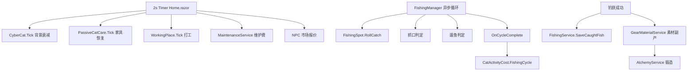

# 游戏设计与算法

本文档从代码中提取公式、权重与常量，说明各系统的设计意图。数值以 `Models/`、`Services/` 源码为准。

---

## 1. 猫四维消耗与活动驱动

### 设计意图

猫咪饥饿、精力、快乐、口渴、健康满值均为 **1000**。消耗分两层：

1. **背景衰减**：每 300 个 tick（≈10 分钟）四维各 -1，挂机/离线极慢掉血。
2. **活动驱动**：钓鱼、打工、派遣、烹饪、市场操作按事件表扣属性；装备仍为成长主轴，猫属性只做微调。

### 核心公式

背景 tick（`CyberCat.Tick`）：

```
每 2s tick 一次，BackgroundTickCount++
当 BackgroundTickCount >= 300:
    Hunger--, Energy -= scaled(1), Happiness -= scaled(1), Thirst -= scaled(1)
    （scaled 受 HouseBuffs 家具倍率影响）
```

活动消耗（`CatActivityCost.Get`）：

| 活动 | 饥饿 | 精力 | 快乐 | 口渴 | 健康 |
|------|------|------|------|------|------|
| 钓鱼一轮 `FishingCycle` | -7 | -10 | +3 | -5 | 0 |
| 打工 tick `WorkTick` | 0 | -2 | -1 | -1 | 0 |
| 派遣出发 | -15 | 0 | -5 | -10 | 0 |
| 派遣归来 | -80 | 0 | 0 | -40 | 0 |
| 烹饪 | -5 | -8 | +2 | -3 | 0 |
| 市场上架/还价 | -2 | -3 | 0 | -2 | 0 |
| 直售鱼 | -1 | -2 | 0 | -1 | 0 |

精力消耗可乘 `CatFishingStats.EnergyCostMultiplier`（STA 减免，见 §5）。

代码注释目标：纯钓鱼约 3~5 轮/分钟 → 精力 -30~50/min；`AutoFeeder` 阈值 500 可维持长期挂机。

```36:39:Models/CatActivityCost.cs
        CatActivityType.FishingCycle => new(-7, -10, +3, -5, 0),
        CatActivityType.WorkTick => new(0, -2, -1, -1, 0),
```

---

## 2. 被动家具 Tick（先扣后补）

### 设计意图

每个 **2s 游戏 tick** 的执行顺序在 `Home.razor` 的 `OnTimerElapsed` 中固定：

1. `cat.Tick(buffs)` — 背景四维衰减（满 300 tick 才扣）
2. 打工、喂食器、饮水器
3. `PassiveCatCare.Tick` — 家具被动恢复

即：**先执行背景扣减，再家具补偿**；被动恢复仅在属性低于阈值时生效，避免刷满溢出。

### 核心公式

```
accumulatedMs += intervalMs   // 每次传入 2000
当 accumulatedMs >= 3000:
    accumulatedMs -= 3000
    对每件已解锁家具:
        if Happiness < HappinessBelow: Happiness += def.Happiness
        if Energy < EnergyBelow:       Energy += def.Energy
```

### 关键常量表

| 家具 ID | 快乐/3s | 精力/3s | 快乐阈值 | 精力阈值 |
|---------|---------|---------|----------|----------|
| CatToy | +8 | +3 | <700 | <1000 |
| JoyPad | +10 | 0 | <700 | — |
| CozyBed | 0 | +8 | — | <800 |
| AromaDiffuser | +12 | 0 | <1000 | — |
| FishTank | +6 | 0 | <1000 | — |
| SunLamp | +4 | +6 | <1000 | <1000 |
| LuxuryTower | +15 | +10 | <1000 | <1000 |

`DefaultIntervalMs = 3000`；饮水泉家具解锁自动饮水器，口渴 <500 时补水。

```2746:2755:Components/Pages/Home.razor
        lock (catStateLock)
        {
            cat.Tick(buffs);
            // ... 打工、喂食器、饮水器 ...
            PassiveCatCare.Tick(cat, UnlockedFurnitureIds(), 2000, ref passiveCareAccumulatedMs);
        }
```

---

## 3. 钓鱼三阶段状态机

### 设计意图

挂机钓鱼由 `FishingManager` 异步循环驱动，每轮：抽鱼 → 等口 → 咬钩抓口 →（Rare+）遛鱼起鱼。失败（脱钩/切线）也触发 `OnCycleComplete` 扣猫精力。

### 状态枚举

```
Idle → Waiting → Biting → Reeling（仅 Rare+）→ 下一轮
```

### 阶段公式

**阶段一：等口（Waiting）**

\[
\text{waitSeconds} = \max\left(2,\; \text{baseWait} \times \max(0.1,\; f_{\text{wait}}) \times \frac{\text{spot.FishingTime}}{3} \times m_{\text{cat}} \times p_{\text{wait}}\right)
\]

其中：

- `baseWait` = Uniform(5, 25) 秒
- \(f_{\text{wait}} = 1 - \text{Attraction} - \text{FishingLevel} \times 0.003 - \text{CastRange} \times 0.02\)
- \(m_{\text{cat}}\) = `catStats.WaitMultiplier`（AGI 减免）
- \(p_{\text{wait}}\) = `catBuff.WaitTimeMultiplier × catBuff.WaitTimePenalty`

**阶段二：咬钩抓口（Biting）**

窗口时长：`template.BiteWindowSeconds × catStats.BiteWindowMultiplier`

抓口成功率（clamp 5%~98%）：

\[
P_{\text{hook}} = \text{clamp}\Big(0.70 + 0.1 \times S_{\text{eff}} + 0.03 \times \text{Cast} + 0.05 \times L_{\text{sens}} + \text{depthBonus} + 0.005 \times Lv + \text{gems} + \text{catHook} - 0.40 \times \text{Wariness} \times (1 - \text{Stealth}) - \text{penalty},\; 0.05,\; 0.98\Big)
\]

**阶段三：遛鱼（Reeling，仅非 Common）**

遛鱼时长：

\[
\text{reelSeconds} = \max\left(1.5,\; (3 + U(0,2)) \times \frac{5.0}{\max(1,\text{GearRatio})}\right)
\]

超重惩罚：

\[
\text{weightPenalty} = \begin{cases}
0.45 & \text{if } w > w_{\text{limit}} \\
\frac{w}{w_{\text{limit}}} \times 0.15 & \text{otherwise}
\end{cases}
\times \text{catStats.WeightPenaltyReduction}
\]

起鱼成功率（clamp 5%~95%）：

\[
P_{\text{land}} = \text{clamp}\Big(0.60 + 0.05 \times D + 0.08 \times S + 0.005 \times Lv + \text{gems} + \text{catLand} - \text{weightPenalty} - 0.20 \times \text{Power} - \text{penalty},\; 0.05,\; 0.95\Big)
\]

```108:134:Services/FishingManager.cs
                double baseWait = 5 + _random.NextDouble() * 20;
                double waitFactor = 1.0 - Loadout.EffectiveAttraction
                    - Loadout.FishingLevel * 0.003
                    - Loadout.CastRange * 0.02;
                waitFactor *= catStats.WaitMultiplier;
                double waitSeconds = Math.Max(2.0, baseWait * Math.Max(0.1, waitFactor));
                // ...
                double hookChance = Math.Clamp(
                    0.70 + Loadout.EffectiveSensitivity * 0.1 + Loadout.CastRange * 0.03
                    + Loadout.EffectiveLineSensitivity * 0.05
                    + depthBonus + Loadout.FishingLevel * 0.005
                    + catStats.HookBonus
                    - template.Wariness * 0.40 * (1 - Loadout.LineStealth) - catBuff.SuccessPenalty,
                    0.05, 0.98);
```

---

## 4. 抽鱼：两层权重、稀有度、体型

### 设计意图

先按钓点 **稀有度表** 抽档位，再在同档鱼种中按 **SpawnWeight** 加权；拟饵品质加成使非 Common 档位权重 ×(1 + rarityBonus)。体型独立 roll，可「升档」但最多抬高一档。

### 第一层：稀有度权重

默认 `FishRarityTable`（静溪等钓点可覆盖）：

| 档位 | 基础权重 | 加成后（非 Common） |
|------|----------|---------------------|
| Common | 70 | 70（不变） |
| Rare | 20 | 20 × (1 + bonus) |
| Epic | 8 | 8 × (1 + bonus) |
| Legendary | 2 | 2 × (1 + bonus) |

`rarityBonus` 来源：拟饵 `RarityBonus` + 猫 LUK + 里程碑 + 宝石 + 开心 buff 等。

### 第二层：同档鱼种 SpawnWeight

```
weight(f) = max(1, SpawnWeight)
若装备特殊饵且匹配: weight × 20
```

特殊饵直接命中：`TargetFishDirectRollChance = 0.22`（22% 必中目标鱼模板）。

### 体型分布 RollSizePercentage

| 概率 | 体型比 sizePercentage | 效果 |
|------|----------------------|------|
| ~1% × (1+bonus) | 1.0 ~ 1.3 | 超规格，传说体型 |
| ~6% × (1+bonus) | 0.85 ~ 1.0 | 巨物 |
| 其余 | Pow(U, 2.2) | 偏小为主 |

实际体重：

\[
w = \text{round}\big(\text{MinWeight} + \text{sizePercentage} \times (\text{MaxWeight} - \text{MinWeight}),\; 1\big)
\]

售价：

\[
\text{price} = \max\big(1,\; \lfloor w \times 10 \times M_{\text{rarity}} \times (1 + s^2) \times \text{PriceMultiplier} \rfloor\big)
\]

\(M_{\text{rarity}}\)：Common 1.0 / Rare 1.5 / Epic 2.5 / Legendary 5.0；神话鱼额外 ×1.4。

```16:22:Models/FishingSpot.cs
    public Dictionary<FishRarity, int> FishRarityTable { get; set; } = new()
    {
        {FishRarity.Common, 70},
        {FishRarity.Rare, 20},
        {FishRarity.Epic, 8},
        {FishRarity.Legendary, 2}
    };
```

---

## 5. 猫六维 → 钓鱼加成

### 设计意图

猫 STR/AGI/SEN/STA/CHM/LUK 由升级与喂食成长；对钓鱼影响 **小于装备**，避免猫属性碾压装备养成。

### 核心公式（CatFishingStatsHelper.Compute）

| 输出 | 公式 |
|------|------|
| HookBonus | SEN×0.08% + STR×0.03% + Lv×0.3% + LUK×0.01% |
| LandBonus | STR×0.06% + STA×0.04% + Lv×0.3% |
| WaitMultiplier | max(0.75, 1 - AGI×0.001) |
| BiteWindowMultiplier | 1 + AGI×0.003 |
| WeightPenaltyReduction | max(0.7, 1 - STR×0.002) |
| RarityBonus | min(0.02, LUK×0.02%) |
| EnergyCostMultiplier | max(0.6, 1 - STA×0.003) |

升级经验：`XpToNext(level) = floor(100 × level^1.4)`

### 状态 Buff（CatBuffHelper，与六维叠加）

| 条件 | 效果 |
|------|------|
| Happiness ≥ 800（或家具降低阈值） | 稀有权重 +5% |
| Energy ≥ 800 | 等口 ×0.92 |
| Hunger < 300 或 Energy < 250 | 抓口/遛鱼 -10%，等口 ×1.15 |
| 维护费拖欠 | 抓口/遛鱼再 -8% |

```54:73:Models/CatFishingStats.cs
        double hookBonus = sen * 0.0008 + str * 0.0003 + lv * 0.003 + luk * 0.0001;
        double landBonus = str * 0.0006 + sta * 0.0004 + lv * 0.003;
        double waitMult = Math.Max(0.75, 1.0 - agi * 0.001);
        double biteWindowMult = 1.0 + agi * 0.003;
        double weightReduction = Math.Max(0.7, 1.0 - str * 0.002);
        double rarityBonus = Math.Min(0.02, luk * 0.0002);
        double energyMult = Math.Max(0.6, 1.0 - sta * 0.003);
```

---

## 6. 装备四槽与钓点竿阶门槛

### 设计意图

四槽：**竿**（敏锐/抛投/钓重）、**轮**（卸力/顺滑/线杯/速比）、**线**（强度/敏锐/隐蔽/耐磨）、**饵**（吸引/品质，消耗品）。`FishingLoadout` 聚合有效数值；承重取三者最小：

\[
w_{\text{limit}} = \min(\text{竿钓重},\ \text{轮线杯},\ \text{线强度})
\]

低耐久（<30）：对应属性 ×0.5（`DurabilityLowMultiplier`）。

### 钓点最低有效竿阶（13 钓点 · 500h 曲线）

| 阶段 | 钓点 | Lv | 最低竿阶 |
|------|------|-----|---------|
| 前期 | 静溪、浅塘 | 1 | T1 |
| T2~T3 | 雾海深渊、芦苇湾 | 8/12 | T2/T3 |
| T4~T5 | 夜光引渠、暗涌裂谷 | 18 | T4/T5 |
| T6~T7 | 极光冰湾、沉船墓场、珊瑚暗流 | 32 | T6/T7 |
| T8~T9 | 远礁外海、深渊回廊、星潮海沟 | 45 | T8/T9 |
| T10 | 虚空钓域 | 60 | T10 |

图鉴规模：≈173 种（去重）· 神话 16 · T8 门槛 75% ≈130 种 · T10 门槛 95% ≈164 种。

有效率（当前实现）：

\[
\text{effectiveness} = \max(0.15,\; \frac{\text{rodTier}}{\text{minTier}} \times 0.75)
\]

低于钓点最低竿阶时影响 `EffectiveSensitivity`、`EffectiveDragPower`。

### 四槽参数作用（摘要）

| 槽位 | 主要参数 | 钓鱼公式中的项 |
|------|----------|----------------|
| 竿 | Sensitivity, CastRange, MaxStrength | 抓口 +S×0.1；等口 -Cast×2%；抓口 +Cast×3% |
| 轮 | DragPower, Smoothness, GearRatio, LineCapacity | 起鱼 +D×0.05，+S×0.08；遛鱼时长 ÷速比 |
| 线 | LineStrength, LineSensitivity, LineStealth, AbrasionResistance | 抓口 +Ls×0.05；精明惩罚 ×(1-Stealth) |
| 饵 | Attraction, RarityBonus | 等口 -Attraction；稀有度加成 |

水层匹配：饵或线与鱼/钓点同层各 +5%，上限 +10%。

```112:118:Models/GearProgressionCatalog.cs
    public static double SpotGearEffectiveness(int rodTier, string spotName)
    {
        int min = SpotMinRodTierFor(spotName);
        if (rodTier >= min) return 1.0;
        int gap = min - rodTier;
        return Math.Max(0.35, 1.0 - gap * TierGapHookPenalty);
    }
```

---

## 7. 炼金锻造 Loop 与素材来源

### 设计意图

T3~T5 装备以 **炼金锻造** 为主路径（`CraftOnly: true`），消耗鱼获、背包素材与金币加工费。宝石/特殊饵/鱼线另有 `AlchemyRecipes`。

### 锻造流程

```
满足解锁条件（钓鱼Lv、猫Lv、图鉴%、许可证）
  → 扣除鱼 + 背包素材 + GoldCost（EconomySinks.AlchemyGearCraftT*Cost）
  → EquipmentService.AddCrafted* 写入装备
  → 猫获得锻造经验（T5:35 / T4:28 / T3:22）
```

### 素材来源（AlchemyMaterials.SourceHint / GearMaterialService）

| 素材 | 主要来源 |
|------|----------|
| 竹片、水草 | 静溪普通鱼分解 |
| 鱼骨、鱼鳞 | 任意鱼分解 |
| 碳纤维丝 | 雾海稀有+分解/钓获副产 |
| 深海结晶 | 远礁外海鱼 |
| 神话鳞粉 | 神话鱼分解 |
| 齿轮组 | 派遣/打工 |
| 树脂、轴承、钛合金框、尼龙原丝 | 生活商店 |
| 鱼鳞粉 | 炼金/分解副产 |

钓获副产：`TryGrantCatchMaterialAsync` 约 22% 触发；直售/上架 `GrantRecycleBonusAsync` 35% 额外返还。

---

## 8. 经济 Sink（维护费、耐久、加工费）

### 设计意图

重复性金币消耗抑制通胀，与 2s/tick 挂机节奏对齐。常量集中在 `EconomySinks`。

### 关键常量表

| 项目 | 数值 | 触发 |
|------|------|------|
| 抛竿费 CastFee | 3g | 开始挂机钓鱼 |
| 切线修理 LineRepairFee | 5g | 切线/跑鱼 |
| 市场上架费 | max(5g, 售价×2%) | 挂单（不退） |
| 喂食器加工 | 2g/份 | 装粮 |
| 饮水器加工 | 1g/份 | 装水 |
| 猫医疗 CatTreatFee | 30g | 低健康/幸福 |
| 每日求购刷新 | 50g | 手动刷新（首刷免费） |
| 炼金宝石 | 500g | 炼制宝石 |
| 炼金特殊饵 | 800g | 炼制路亚 |
| 宝石镶嵌 | 200g | 镶嵌 |
| 装备锻造 T3~T10 | 1200 / 6500 / 20k / 42k / 68k / 98k / 135k / 185k g | 炼金锻造 |
| 抛竿费 CastFeeForSpot | 3~58g | 按钓点阶 |
| 装备修理 | 30~180g 部分修；满修×阶位系数 | 按装备 T 阶 |
| 装备部分修理 | 50g (+20 耐久) | 按需 |
| 装备满修 | max(50, 强度×10) | 按需 |
| 钓点日租 | 380~3200g/日 | 11 个许可钓点递增 |
| 钓点永久证 | 12000~120000g | 虚空钓域最贵 |

### 维护费（MaintenanceService）

每 **720 tick**（≈24 分钟现实时间 ≈ 1 游戏日）：

\[
\text{fee} = \text{房间数} \times 15 + \text{家具数} \times 8 + \sum \text{升级等级} \times 3
\]

拖欠时费用 ×2，猫幸福 -50。

### 耐久

- 低耐久阈值：30，属性 ×0.5
- 切线：鱼线耐久 -max(1, round(8×(1-耐磨)))
- 拟饵：切线 -1 次使用，归零扣库存

---

## 9. 成长曲线 T1→T10 · 500h 毕业

**毕业定义**：全套 T10 四槽 + 全图鉴 95% + 全神话鱼各 1 条。

挂机 **2s/tick** 累计目标（`GearProgressionCatalog.TierCumulativeTargetHours`）：

| 阶段 | 累计目标 | 里程碑 |
|------|---------|--------|
| T1~T3 | ~40h | 静溪/雾海熟练 |
| T4~T6 | ~160h | 引渠+派遣素材 |
| T7~T8 | ~310h | 冰湾+鱼市回收 |
| T9~T10 | ~500h | 远礁+神话+终极锻造 |

装备阶位：T1~T5 入门→神话；T6 星陨 → T7 虚空 → T8 沧溟 → T9 神谕 → T10 终极；`MaxCatLevel = 80`。

图鉴门槛：T8 **75%** · T9 **85%** · T10 **95%** + 全神话。钓鱼/猫 Lv40+ XP 指数放缓。

---

## 10. 鱼市还价与离线补偿

### 鱼市

- **直售**：`SellPrice × 0.85`（`MarketService.DirectSellRate`）
- **市场底价**：`SellPrice × 0.90`
- **挂单上限**：3 + min(摊位券, 2)，最高 5
- **NPC 报价间隔**：150 tick（5 分钟）；鱼市搬运工种 120 tick
- **还价成功率**：

\[
P_{\text{counter}} = \text{clamp}\big(0.50 + \frac{\text{Happiness}}{1000} \times 0.20 - 0.10 \times 0.30 + \text{milestoneBonus},\; 0.10,\; 0.90\big)
\]

默认还价幅度 `CounterPercent = 0.10`（+10%）；失败可能触发买家 24h 封禁。

### 离线补偿（OfflineCompensationService）

登录时根据 `LastActiveAt` 补算 tick：

```
rawTicks = floor(elapsed_ms / 2000)
ticks = min(rawTicks, 900)   // 上限 30 分钟（500h 曲线防跳过）
```

每 tick 模拟：猫背景衰减、打工金币、维护费结算、NPC 市场报价；**不含钓鱼**。离线消息在 `Home.razor` 横幅展示。

```22:24:Services/OfflineCompensationService.cs
    public const int TickIntervalMs = 2000;
    public const int MaxOfflineTicks = 900;
```

```61:64:Services/OfflineCompensationService.cs
        int rawTicks = (int)(elapsed.TotalMilliseconds / TickIntervalMs);
        int ticks = Math.Min(rawTicks, MaxOfflineTicks);
        bool wasCapped = rawTicks > MaxOfflineTicks;
```

---

## 附录：系统依赖关系简图


