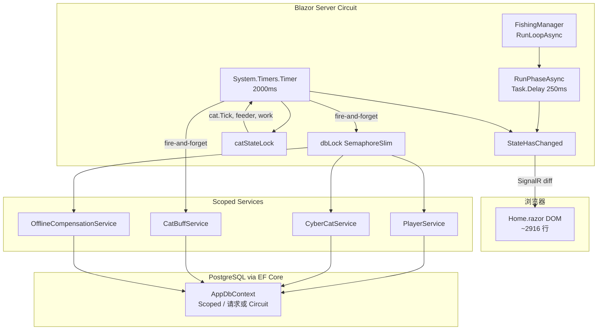

# CyberPetApp 性能分析报告

> 基于仓库真实代码静态分析（2026-06-10）。未运行负载测试；结论附文件路径与行号，便于对照验证。

---

## 1. 执行摘要（Top 5）

| # | 严重度 | 发现 |
|---|--------|------|
| 1 | **Critical** | `Home.razor` 每 **2 秒** `StateHasChanged` 触发整页 Blazor Server 重渲染，同时 `PersistGameStateAsync` 向 PostgreSQL 发起 **最多 3 次** `SaveChanges`（猫 + 玩家 + `LastActiveAt`），另有 `TickFoodBuffsAsync` 可能再写库。 |
| 2 | **Critical** | 挂机钓鱼时 `FishingManager.RunPhaseAsync` 每 **250ms** 调用 `OnChanged → StateHasChanged`，SignalR 消息频率约为空闲时的 **20 倍**。 |
| 3 | **High** | `GetHouseBuffs()` 每次渲染多次执行 LINQ 聚合（遍历全部已解锁家具），无缓存；侧边栏 `CatCareSidebar` 始终挂载，随主 tick 每 2s 重绘。 |
| 4 | **High** | `CyberCatService.SaveAsync` 每次存档都 `FirstOrDefaultAsync` 查猫再 `SaveChanges`，与 `PlayerService.SaveProgressAsync` 的 `FindAsync` 形成 **重复查询 + 多次提交**。 |
| 5 | **Medium** | `Home.razor` 单体 **~2916 行 / ~145KB**，20+ 服务注入；子组件无 `ShouldRender` 优化，`DebuffLines.ToList()` 等每次分配新集合，放大 diff 体积。 |

**已有良好实践（不必重复造轮子）：** `FishingManager.EventLog` 上限 10 条；`FishDexCatalog` 对空记录有静态缓存；`activeSection` 用 `@switch` 只渲染当前 Tab；`dbLock` 串行化 Scoped `DbContext`；`LeaderboardService` 使用 `AsNoTracking`。

---

## 2. 架构概览



**数据流要点：**

- 一个用户会话 = 一个 Blazor Circuit + 一套 Scoped 服务 + 内存中的 `Player` / `CyberCat` / `PlayerHouse`。
- **游戏心跳**在 `Home.razor` 的 `OnTimerElapsed`（`2740:2782`），不在服务端 BackgroundService。
- **钓鱼状态机**在组件内 `new FishingManager()`（`1446`），非 DI 单例；与页面同生命周期。
- 所有 DB 写操作经 `WithDbLock`（`1496:1500`）串行，避免 EF Core 并发异常，但会排队阻塞 UI 相关异步回调。

---

## 3. 热点分析

### 3.1 Blazor UI

#### 3.1.1 巨型单页组件

`Components/Pages/Home.razor`：

- `@rendermode InteractiveServer`（`30`）— 所有交互经 SignalR 回传 diff。
- **2916 行**，Markup + `@code` 合体，注入 20+ 服务（`6:26`）。
- 标题栏、侧边栏 `CatCareSidebar`、状态栏 **不随 Tab 切换卸载**，每次 `StateHasChanged` 都会参与 diff。

#### 3.1.2 双 Timer 叠加刷新

| 来源 | 间隔 | 位置 | 行为 |
|------|------|------|------|
| `gameTimer` | 2000ms | `2723:2725`, `2740:2782` | 猫 tick、打工、喂食器、存档、`StateHasChanged` |
| `FishingManager` 阶段计时 | 250ms | `FishingManager.cs` `204:209` | `OnChanged → InvokeAsync(StateHasChanged)`（`2712`） |
| `ExpeditionPanel` | 1000ms | `ExpeditionPanel.razor` `87` | 仅 expedition Tab 可见时存在 |

钓鱼进行中：**250ms UI 刷新 + 2000ms 全局刷新** 叠加。

#### 3.1.3 子组件与 Parameter 导致的重渲染

- **`CatCareSidebar`**（`88:102`）：始终渲染。父组件每次计算：
  - `CatState()` / `CatMoodText()`（`1510:1526`）
  - `GetHouseBuffs()` → `CatBuffHelper.Compute`（`81`）
  - `sidebarDebuffLines` 新建 `List`（`82:84`）
  - `PassiveCareSummaryLines()` → `UnlockedFurnitureIds()` LINQ（`1555:1561`）
- **无 `ShouldRender` / `@key` 优化**：全仓库未使用 `ShouldRender`。
- **Tab 内子组件**：`@switch (activeSection)`（`240`）仅渲染当前 Tab — 设计合理；但父级 tick 仍触发子树 diff 计算。
- **`FishDexPanel`**：`OnParametersSet` 调用 `FishDexCatalog.BuildAll(Records)`（`69:73`）。在 fishing Tab 时，每 2s 父刷新会重建图鉴条目（即使 `fishRecords` 未变，仍会执行 `OnParametersSet`）。
- **`GearShopPanel`**：`DexEntries="GetFishDex()"`（`644`）— gear shop 子 Tab 每次父渲染重建完整图鉴列表。

#### 3.1.4 渲染期重复计算

单次 `StateHasChanged` 渲染中，`GetHouseBuffs()` 在 Markup 中被调用 **至少 4 次**（`81`, `261`, `274`, `312` 等），每次执行 `HouseBuffAggregator.Aggregate(playerHouse)`（`2637:2638`, `HouseBuffs.cs` `293:297`）— 遍历全部房间家具。

`PendingOfferCount()` 在 Tab 条被调用 **3 次**（`166`, `174`, `176`, `1428`）。

---

### 3.2 EF Core / 数据层

#### 3.2.1 DbContext 生命周期

`Program.cs` `21:23`：`AddDbContext<AppDbContext>` 默认 **Scoped**。Blazor Server 下 Scoped = **per Circuit**，与 `Home` 页面内存态一致，设计正确。

#### 3.2.2 每 2s Tick 的写库路径

`OnTimerElapsed`（`2740:2782`）末尾：

```csharp
_ = TickFoodBuffsAsync();      // 可能 SaveChanges + SaveAsync(cat)
_ = PersistGameStateAsync();   // SaveAsync(cat) + SaveProgressAsync + TouchActiveAsync
InvokeAsync(StateHasChanged);
```

`PersistGameStateAsync`（`2877:2893`）单次 tick 内：

1. `CyberCatService.SaveAsync` → `FirstOrDefaultAsync` + `SaveChangesAsync`（`CyberCatService.cs` `36:63`）
2. `PlayerService.SaveProgressAsync` → `FindAsync` + `SaveChangesAsync`（`PlayerService.cs` `48:82`）
3. `OfflineCompensationService.TouchActiveAsync` → `FindAsync` + **又一次** `SaveChangesAsync`（`OfflineCompensationService.cs` `122:130`）

`TickFoodBuffsAsync`（`2854:2873`）：

- 查询全部 `PlayerCatBuffs`（`CatBuffService.cs` `82:84`）
- 有变更时 `SaveChangesAsync`（`112:113`）
- **再次** `CyberCatService.SaveAsync(cat)`（`2863`）

**最坏情况：每 2 秒 4～5 次 `SaveChanges`，2～3 次猫表查询。**

#### 3.2.3 读路径与 N+1

| 路径 | 评估 |
|------|------|
| `PlayerService.LoadPlayerAsync` | 3 次查询（Player + Fishes + BackpackItems），可接受 |
| `HouseService.LoadHouseAsync` | House + Rooms + Furnitures 分批，无 N+1 |
| `MarketService.GetActiveListingsAsync` | 2 次查询 + 内存 join（`59:78`），良好 |
| `HandleFishCaughtAsync` | 单次起鱼串行 8+ 服务调用（`1839:1853`），含 `ReloadLeaderboardAsync` 3 查询 |
| `CyberCatService.SaveAsync` | **每次** `FirstOrDefaultAsync`，未利用已跟踪实体 |

`Include` 使用极少；多数服务手动组装图，避免导航属性 N+1，但重复 `FindAsync` 成为新瓶颈。

#### 3.2.4 初始化重复加载

`OnInitializedAsync`（`2690:2720`）中 `ReloadMarketAsync` 被调用 **两次**（`2699` 锁内、`2719` 锁外）。

---

### 3.3 游戏 Tick / FishingManager

- `FishingManager` 为组件私有实例（`1446`），`FishingSpots` 构造时 `FishingSpotCatalog.BuildAll()`（`FishingManager.cs` `54`）— 每 Circuit 一份，可接受。
- `RunLoopAsync` 每轮循环调用 `_getCatBuff` / `_getCatStats` 闭包（`97:100`），内部再次 `GetHouseBuffs()` + `CatBuffHelper.Compute`。
- 起鱼回调 `HandleFishCaughtAsync`（`1811:1888`）持有 `dbLock` 期间执行大量 IO，阻塞其他 DB 操作。
- `OnGearWear` / `OnLureConsumed` 每次切线触发多次 `EquipmentService` 查询 + 全量重载 `myRods/myReels/myLines`（`1909:1913`）。

---

### 3.4 锁与并发

| 锁 | 类型 | 位置 | 风险 |
|----|------|------|------|
| `catStateLock` | `object` | `1494`, `2746` 等 | Timer 线程与钓鱼回调争用；持锁期间做 `feeder.CheckAndFeed`、LINQ，时间较短 |
| `dbLock` | `SemaphoreSlim` | `1492`, `1496` | **所有** DB 操作串行；`PersistGameState` 与 `TickFoodBuffs` 并发 `_=` 启动会排队 |
| `EventLog` | `lock` | `FishingManager.cs` `253` | 仅写日志，影响小 |

`FishingSessionRegistry`（`Services/FishingSessionRegistry.cs`）：静态 `ConcurrentDictionary`，O(1) 占用检测，内存可忽略。`circuitId` 为组件级 `Guid`（`1474`），非 Blazor CircuitId — 功能上每浏览器 Tab 一个实例，符合设计。

**UI 线程**：`System.Timers.Timer` 回调在 ThreadPool 运行，`InvokeAsync(StateHasChanged)` 正确 marshal 到同步上下文；但高频 marshal + 大 diff 仍会造成客户端卡顿。

---

### 3.5 内存与分配

| 模式 | 位置 | 频率 |
|------|------|------|
| `sidebarDebuffLines.ToList()` | `Home.razor` `82:84` | 每 2s+ |
| `HouseBuffAggregator` 新建 `List<string> SummaryLines` | `HouseBuffs.cs` `180` | 每次 `GetHouseBuffs()` |
| `FishDexCatalog.BuildAll` | 多处 | fishing/gear Tab 每 tick |
| `ABar` / `ProgressBar` 分配 `new string('█', …)` | `Home.razor` `1504`, `CatCareSidebar` `129` | 每次渲染 |
| `UnlockedFurnitureIds()` `SelectMany` | `1558:1561` | Timer 内 + 渲染 |

静态 Catalog（`FurnitureCatalog`, `FishingSpotCatalog`, `GearCatalog`）均为静态字典 — **正确**，不在 tick 重建。

---

### 3.6 网络 / SignalR

- Blazor Server diff 大小与 `Home.razor` DOM 节点数正相关；侧边栏 ASCII 进度条、多 Tab 表单、鱼市表格均在同一组件树。
- 钓鱼阶段 250ms 刷新进度条（`PhaseRemainingSeconds`）是主要 **带宽与 CPU diff** 来源。
- `EventLog` 已限 10 条（`FishingManager.cs` `256`）— **quick win 已存在**。

---

### 3.7 资产（次要）

- 像素图标通过 `PixelIcon` + CSS 雪碧图（`wwwroot/cyberpet-theme.css`），无大量独立图片请求 — 负载低。
- `CatSprite` 组件随侧边栏每 2s 刷新，但仅为 CSS class 切换，影响有限。

---

## 4. 问题清单表

| 严重度 | 位置 | 现象 | 影响 |
|--------|------|------|------|
| Critical | `Home.razor` `2782` + `2877:2893` | 每 2s 全页 `StateHasChanged` + 3× `SaveChanges` | DB 连接池压力、磁盘 WAL；多用户时 PostgreSQL 成为瓶颈 |
| Critical | `FishingManager.cs` `204:209`, `Home.razor` `2712` | 钓鱼阶段 250ms `OnChanged` | SignalR 流量激增、客户端重绘卡顿 |
| High | `CyberCatService.cs` `34:63` | 每次 Save 先 SELECT 再 UPDATE | 无意义重复查询，存档延迟翻倍 |
| High | `Home.razor` `2637:2638` | `GetHouseBuffs()` 渲染期多次 LINQ 聚合 | CPU 浪费，随家具数量线性增长 |
| High | `Home.razor` `2854:2873` + `2877:2893` | 同 tick 双路径写猫状态 | 重复 `SaveAsync(cat)`，dbLock 排队 |
| High | `OfflineCompensationService.cs` `122:130` | `TouchActiveAsync` 独立 `SaveChanges` | 与 `SaveProgressAsync` 可合并为一次提交 |
| Medium | `Home.razor` + partial | ~~2916 行~~ → markup 409 行 + `Home.*.cs` partial | ✅ 阶段三已拆；diff 仍随父 tick 但 @code 可维护性改善 |
| Medium | `Home.razor` `82:84`, `644` | 每次渲染新建 List / 重建 Dex | GC 压力，子组件 Parameter 引用变化强制刷新 |
| Medium | `HandleFishCaughtAsync` `1853` | 每条鱼 ReloadLeaderboard | 起鱼高峰时 3 额外查询/次 |
| Medium | `CatBuffService.cs` `TickBuffsAsync` | ~~Tick 加载玩家全部 Buff 行~~ → 已过滤未过期 | ✅ 过期行单独查询删除 + 仅加载 `ExpiresAt > now` |
| Medium | `ExpeditionPanel.razor` `87` | 1s Timer 独立刷新 | expedition Tab 打开时额外 SignalR 流量 |
| Low | `Home.razor` `2699`+`2719` | 初始化双次 `ReloadMarketAsync` | 仅首次加载多 2 查询 |
| Low | `PlayerService.SaveProgressAsync` | ~~每次 `FindAsync`~~ → `SyncProgressToTracked` | ✅ 与 P0-1 对齐 |
| Low | `FishingSessionRegistry` | 静态字典无过期 | 异常断线可能残留条目（功能问题 > 性能） |

---

## 5. 优化建议

### P0 — 立即（高收益 / 低风险）

#### P0-1：合并每 tick 的数据库提交

- **问题**：2s 内心跳触发 3～5 次 `SaveChanges`。
- **根因**：`PersistGameStateAsync`、`TouchActiveAsync`、`TickFoodBuffsAsync` 各自独立提交；`SaveProgressAsync` 与 `TouchActiveAsync` 都写 `Player` 行。
- **改法**：
  1. 新增 `GamePersistenceService.SaveTickAsync(player, cat)`，单事务内更新猫 + 玩家（含 `LastActiveAt`）。
  2. `TickFoodBuffsAsync` 只改 Buff 表，**移除**其中 `CyberCatService.SaveAsync`（`2863`），猫状态由合并方法统一写。
  3. `TouchActiveAsync` 并入 `SaveProgressAsync`，不再单独 `SaveChanges`。
- **预期收益**：每用户 DB 写入 **减少 60～80%**；tick 延迟下降，dbLock 持有时间缩短。

#### P0-2：钓鱼 UI 与逻辑解耦刷新

- **问题**：250ms 全页 `StateHasChanged`。
- **根因**：`OnChanged` 绑定整页刷新（`2712`）。
- **改法**：
  1. 将钓鱼进度条 + EventLog 拆为 `FishingStatusPanel` 子组件，仅该组件订阅 `OnChanged`。
  2. 子组件 `ShouldRender`：仅当 `PhaseRemainingSeconds` 变化 >0.5s 或 `State` 变化时返回 true。
  3. 或改用 `Task.Delay(1000)` 降低 phase 刷新频率（游戏性允许的前提下）。
- **预期收益**：钓鱼时 SignalR 消息量 **降 50～75%**。

#### P0-3：消除 `CyberCatService.SaveAsync` 重复查询

- **问题**：每次存档 `FirstOrDefaultAsync`。
- **根因**：未保持 EF 跟踪引用；`SaveAsync` 设计为「无状态」。
- **改法**：`GetOrCreateAsync` 返回 tracked 实体；`SaveAsync` 对 `DbContext.Entry(cat).State == Unchanged` 直接 `SaveChanges`，或仅在属性脏时更新。更进一步：tick 存档用 `ExecuteUpdate` 单条 SQL。
- **预期收益**：每次存档少 1 次 RTT，tick 存档延迟 **~30～50%**。

#### P0-4：缓存 `HouseBuffs`

- **问题**：每次渲染多次聚合家具。
- **根因**：`GetHouseBuffs()` 无 memoization。
- **改法**：在修改家具/升级后调用 `InvalidateHouseBuffs()`；其余时候读 `_cachedHouseBuffs` 字段。`milestoneBuffs` 变化时同样失效。
- **预期收益**：渲染 CPU **降 10～20%**（家具多时更明显）。

---

### P1 — 短期（1～2 迭代）

#### P1-1：`CatCareSidebar` 精细化刷新

- **问题**：侧边栏随整页每 2s 刷新。
- **改法**：传入 `CatVitalsSnapshot` 值类型 record（饥饿/精力/幸福等 int），`ShouldRender` 仅比较数值变化；`DebuffLines` 改为 `IReadOnlyList` 字段缓存，内容不变时不换引用。
- **预期收益**：侧边栏 diff 体积 **降 40%+**。

#### P1-2：降低全局 tick 刷新频率或条件刷新

- **问题**：猫属性变化很小时仍全页刷新。
- **改法**：`OnTimerElapsed` 末尾比较关键字段快照，无变化则跳过 `StateHasChanged`；或 timer 改为 3～5s，钓鱼/打工逻辑仍按 2s 倍率结算（需调整常量）。
- **预期收益**：空闲挂机时 SignalR **降 50%**。

#### P1-3：`FishDex` / `GetFishDex()` 缓存

- **问题**：`FishDexCatalog.BuildAll` 在 gear/fishing Tab 每 tick 执行。
- **改法**：`fishRecords` 变更时（`HandleFishCaughtAsync`）更新 `_fishDexCache`；Markup 绑定缓存字段。
- **预期收益**：gear/fishing Tab 打开时 CPU **降 15%**。

#### P1-4：起鱼路径异步化 Leaderboard

- **问题**：`HandleFishCaughtAsync` 同步 `ReloadLeaderboardAsync`（`1853`）。
- **改法**：Leaderboard 改为手动刷新或 30s 防抖；起鱼仅更新本地统计。
- **预期收益**：起鱼落库路径 **少 3 查询/次**。

#### P1-5：合并 `OnInitializedAsync` 重复 `ReloadMarketAsync`

- **问题**：`2699` 与 `2719` 重复。
- **改法**：删除锁外第二次调用。
- **预期收益**：首次加载少 2 次 DB 查询（一次性）。

#### P1-6：`ExpeditionPanel` Timer 优化

- **问题**：1s 刷新整个 expedition 面板。
- **改法**：仅倒计时文本用 `setInterval` JS 互操作，或 `ShouldRender` 仅在 `Remaining` 分钟变化时刷新。
- **预期收益**：expedition Tab 打开时消息 **降 50%**。

---

### P2 — 长期（架构）

#### P2-1：拆分 `Home.razor` 为 Tab 页面组件 — **✅ 阶段一 + 阶段二**

- 阶段一：`HomeFishingTab` / `HomeHouseTab` / `HomeGearTab`。
- 阶段二：`HomeWorkTab` / `HomeExpeditionTab` / `HomeMarketTab` / `HomeCookingTab` / `HomeAlchemyTab` / `HomeLifeShopTab` / `HomeMilestonesTab` / `HomeBackpackTab`。
- 共用：`GameSessionState` + `CascadingValue`；`HomeTabBase.ShouldRender` + 父级 `tickGeneration`；操作经 `EventCallback` 回 `Home.razor` `@code`。
- 钓鱼 250ms 进度仍由 `FishingStatusPanel` 局部刷新；非活动 Tab 不渲染。
- **收益**：`Home.razor` markup 显著收缩，局部 diff；`@code` 业务逻辑仍留 Home，可后续迁入服务。

#### P2-2：服务端 Background Tick（可选）— **轻量版 ✅ / 全站 IHostedService ⏳**

- **已实现（轻量版）**：`Services/GameTickOrchestrator.cs` 封装 2s 模拟，返回 `TickResult`；`Home.GameLoop.cs` Timer 仅调用 orchestrator；`GameSessionState` 存 `TickRenderSnapshot` / `TickGeneration` / `CatVitalsSnapshot`。
- **未做**：跨 Circuit `IHostedService` + `IObservable<GameSnapshot>`（复杂度高，见 `Program.cs` 注释）。
- **收益**：UI 与 tick 业务解耦，Home markup 不再承载模拟逻辑。

#### P2-3：Blazor 混合渲染 — **试点未实施（有原因）**

- **目标**：milestones / backpack / lifeshop 用 `InteractiveAuto` 或 SSR 降 Circuit 成本。
- **阻塞**：`InteractiveAuto` 需 `AddInteractiveWebAssemblyComponents` + Client 项目；当前仅 Server 单项目，强行改会破坏 EventCallback 回父级 Home。
- **已有替代**：`HomeTabBase.ShouldRender` + 非活动 Tab 不渲染；本轮不迁移 Wasm。

#### P2-4：PostgreSQL 批量写与 JSON 列 — **TODO，未实现**

- 背包/鱼包若持续增长，考虑 `jsonb` 列或 Redis 缓存热数据，减少多表 join。
- **收益**：玩家规模上千时才有意义。
- **代码锚点**：`Program.cs` P2-4 TODO 注释。

#### P2-5：`FishingSessionRegistry` 与 Circuit 生命周期挂钩 — **✅ 已实现**

- `Services/FishingCircuitHandler.cs`：`OnCircuitClosed` → `FishingSessionRegistry.StopByCircuit(circuit.Id)`。
- `Program.cs` 注册 `CircuitSessionContext` + `FishingCircuitHandler`；`Home` 通过 `CircuitSessionContext.CircuitId` 占用会话。
- **收益**：主要解决泄漏与多 Tab 体验，非吞吐瓶颈。

---

## 6. 测量建议

以下做法可在本地/Staging 验证上述结论，**无需改代码即可开始**。

### 6.1 `dotnet-counters`（ASP.NET Core 全局）

```bash
dotnet-counters monitor --process-id <pid> \
  Microsoft.AspNetCore.Hosting \
  System.Runtime \
  Microsoft.EntityFrameworkCore
```

关注指标：

- `requests-per-second` / `current-requests`
- `alloc-rate` — 是否随钓鱼开始飙升
- `gc-heap-size` — Circuit 长时间挂机是否持续增长
- EF：`active-db-contexts`、`total-queries`（若启用 EF 计数器源）

### 6.2 日志埋点（临时）

在 `PersistGameStateAsync`、`TickFoodBuffsAsync`、`HandleFishCaughtAsync` 入口加 `ILogger` + `Stopwatch`：

```csharp
_logger.LogInformation("PersistGameState took {Ms}ms", sw.ElapsedMilliseconds);
```

统计 5 分钟挂机：p50/p95 存档耗时、每小时 `SaveChanges` 次数。

### 6.3 MiniProfiler + EF（开发环境）

`Program.cs` 添加：

```csharp
builder.Services.AddMiniProfiler(options => options.RouteBasePath = "/profiler")
    .AddEntityFramework();
```

访问 `/profiler` 查看每 tick  SQL 条数与重复查询。重点验证 P0-1 / P0-3。

### 6.4 Blazor Server Circuit 诊断

启用详细日志：

```json
"Logging": {
  "LogLevel": {
    "Microsoft.AspNetCore.Components.Server.Circuits": "Debug"
  }
}
```

观察 `StateHasChanged` 触发频率是否与 250ms / 2s 吻合。

### 6.5 浏览器 DevTools

- **Network → WS**：选中 Blazor WebSocket，统计每秒二进制帧数量与字节数；对比「空闲挂机」vs「钓鱼中」。
- **Performance**：录制 10s，查看主线程 Layout / Paint 是否每 250ms 尖峰。

### 6.6 负载测试（多用户）

用 k6 / Bombardier 模拟 50～100 并发 Circuit（需专用测试 harness 或 Playwright 多上下文），观察：

- PostgreSQL `pg_stat_statements` 中 `UPDATE "CyberCats"` / `"Players"` 频率
- 应用进程 CPU 与 Gen2 GC 次数

### 6.7 验收基准（建议建立）

| 场景 | 指标 | 目标（优化后） |
|------|------|----------------|
| 空闲挂机 | SQL 写/分钟/用户 | ≤ 30（现约 90+） |
| 钓鱼中 | WS 出站 KB/s | < 50 |
| 起鱼 | `HandleFishCaughtAsync` p95 | < 200ms |
| 首次加载 | `OnInitializedAsync` | < 1s（本地 DB） |

---

## 7. 不建议动的部分

| 区域 | 原因 |
|------|------|
| `dbLock` 串行化 Scoped DbContext | 正确修复并发问题的最小方案；应先合并写再考虑去掉锁 |
| 静态 Catalog 字典 | 已零分配热路径，无需改 |
| `EventLog` 10 条上限 | 已做截断，无需再优化 |
| `activeSection` @switch 单 Tab 渲染 | 合理，问题在父级 tick 而非 Tab 策略 |
| `FishingSessionRegistry` ConcurrentDictionary | 数据量 = 在线钓鱼人数，非热点 |
| 像素雪碧图 CSS 方案 | 资产加载不是瓶颈 |
| 过早引入 Redis / 读写分离 | 当前瓶颈在 per-tick 写库与 SignalR 频率，非读扩展 |
| 将 `InteractiveServer` 全改为 WASM | 工作量大；应先做 P0 局部刷新，投入产出比更高 |

---

## 附录：关键代码索引

| 主题 | 文件 | 行号（约） |
|------|------|-----------|
| 2s Timer + 存档 | `Home.GameLoop.cs` / `GameTickOrchestrator.cs` | `OnTimerElapsed`、`SaveGameTickAsync` |
| dbLock / catStateLock | `Components/Pages/Home.razor` | 1492–1500, 2746 |
| 钓鱼 250ms 刷新 | `Services/FishingManager.cs` | 196–210 |
| EventLog 截断 | `Services/FishingManager.cs` | 251–257 |
| DbContext Scoped | `Program.cs` | 21–23 |
| 猫存档重复查询 | `Services/CyberCatService.cs` | 34–63 |
| 家具 Buff 聚合 | `Models/HouseBuffs.cs` | 161–297 |
| 市场列表查询 | `Services/MarketService.cs` | 59–78 |
| 图鉴构建 | `Models/FishDexCatalog.cs` | 18–40 |

---

*文档版本：1.1 · 与代码快照 2026-06-10 对应*

---

## 8. 已实现优化清单

| 阶段 | 项 | 状态 | 说明 |
|------|-----|------|------|
| P0 | P0-1 合并 tick 写库 | ✅ | `SaveGameTickAsync` 单事务猫+玩家+`LastActiveAt` |
| P0 | P0-2 钓鱼局部刷新 | ✅ | `FishingStatusPanel` 订阅 `FishingManager.Changed` + `ShouldRender` |
| P0 | P0-3 猫存档去重查 | ✅ | `CyberCatService` tracked 实体 |
| P0 | P0-4 `HouseBuffs` 缓存 | ✅ | `InvalidateHouseBuffs()` |
| P1 | P1-1 侧边栏精细化 | ✅ | `CatVitalsSnapshot` + `CatCareSidebar.ShouldRender` |
| P1 | P1-2 条件 tick 刷新 | ✅ | `TickRenderSnapshot` 比较后跳过 `StateHasChanged` |
| P1 | P1-3 FishDex 缓存 | ✅ | `_fishDexCache` |
| P1 | P1-4 Leaderboard 防抖 | ✅ | 起鱼路径 debounce / 手动刷新 |
| P1 | P1-5 去重 `ReloadMarketAsync` | ✅ | 初始化仅一次市场加载 |
| P1 | P1-6 ExpeditionPanel | ✅ | 倒计时 `ShouldRender` |
| **P2** | **P2-1 拆分 Home Tab（阶段一）** | **✅** | `HomeFishingTab` / `HomeHouseTab` / `HomeGearTab` |
| **P2** | **P2-1 拆分 Home Tab（阶段二）** | **✅** | `HomeWorkTab` / `HomeExpeditionTab` / `HomeMarketTab` / `HomeCookingTab` / `HomeAlchemyTab` / `HomeLifeShopTab` / `HomeMilestonesTab` / `HomeBackpackTab`；`Home.razor` 2670→1969 行 |
| **P2** | **P2-1 拆分 Home @code（阶段三）** | **✅** | `Home.razor` 409 行 markup；`Home.razor.cs` + `Home.GameLoop` / `Home.Fishing` / `Home.Market` partial；`GameTickOrchestrator` |
| **P2** | **P2-2 轻量 Tick 解耦** | **✅** | `GameTickOrchestrator` + `TickResult` + `GameSessionState.TickRenderSnapshot`；非 IHostedService |
| **P2** | **P2-3 混合渲染试点** | **⏸** | 缺 WASM Client；`HomeTabBase.ShouldRender` 已降 Tab 刷新 |
| **P2** | **P2-5 Circuit 清理钓鱼会话** | **✅** | `FishingCircuitHandler` + `FishingSessionRegistry.StopByCircuit` + Blazor `circuit.Id` |
| 读路径 | Market/FishRecord AsNoTracking | **✅** | `MarketService.GetActiveListingsAsync`、`FishRecordService.GetRecordsAsync` |
| 读路径 | Leaderboard AsNoTracking | **✅** | `GetTopFishAsync` / `GetTopLevelsAsync` 已有；`GetServerStatsAsync` 补全 |
| 侧边栏 | Vitals 独立更新通道 | **✅** | 移除渲染期 `RefreshSidebarVitals`；`TryRefreshSidebarVitals` + `GameSessionState.CatVitalsSnapshot` |
| §4 | B-1 `SaveProgressAsync` 去 FindAsync | ✅ | `SyncProgressToTracked`（P0-1 已含） |
| §4 | B-2 `CatBuffService` Tick 过滤 | ✅ | 过期 Buff 单独删除；活跃 Buff `ExpiresAt > now` |
| §4 | B-3 P0-3 进阶 ExecuteUpdate | ✅ | `CyberCatService.PersistCatForTickAsync`：未跟踪猫 tick 单条 UPDATE |
| §6.3 | MiniProfiler + EF（Development） | ✅ | `Program.cs` `IsDevelopment()` 注册；访问 `/profiler` |
| P2 | P2-2 轻量 Tick 解耦 | ✅ | `GameTickOrchestrator`；全站 IHostedService 仍 TODO |
| P2 | P2-3 混合渲染 | ⏸ | 单项目无 WASM Client；见 §5 P2-3 |
| P2 | P2-4 PostgreSQL jsonb | ⏳ TODO | `Program.cs` 注释；未改 schema |

**P2-1 阶段三（本轮）：** `@code` 迁出为 `Home.razor.cs` + `Home.GameLoop.cs` / `Home.Fishing.cs` / `Home.Market.cs`；`Home.razor` 仅 markup **409 行**（原 1969）。

**P2-5 备注：** `Home` 仍用组件级 `CircuitId`（`CircuitSessionContext` 注入，fallback `Guid`）与注册表对齐；断线时 `OnCircuitClosed` 按 Blazor `circuit.Id` 清扫残留。
